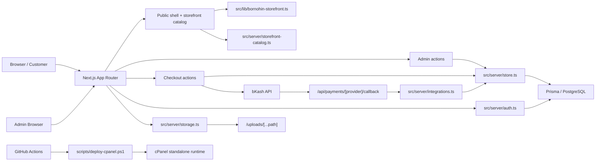

# Project Current State Audit

Repository: Easy e-Com
Date: 2026-07-26
Scope: source-level audit only. No production data was modified and no external customer messages were sent.

## 1. Executive Summary

Overall maturity: late prototype / partial launch candidate.

What looks production-ready:
- Admin route protection exists and is enforced.
- Core catalog browsing is wired through the app router and renders cleanly.
- The bKash callback path verifies a request signature before confirming payment.
- File upload storage resolves paths safely and serves uploaded files without traversal.

What is not production-ready:
- Customer self-service is incomplete.
- Order tracking and cancellation/refund behavior is not fully correct.
- SEO and persistent wishlist/address/account flows are incomplete.
- Health and readiness checks are too shallow for real production confidence.

Most serious functional gaps:
- Payment success currently links to a non-existent `/track` route.
- Delivery cancellation does not release reserved inventory.
- The storefront still uses hardcoded shipping messaging in the cart drawer.
- Product image replacement does not clean up old files on disk.
- Analytics IDs are injected into inline script blocks without sanitization.

Most serious technical risks:
- `src/server/store.ts` is a large transactional choke point.
- The app changes behavior when `DATABASE_URL` is absent, which hides production drift.
- There is no real worker/queue implementation even though Redis appears in compose.
- The health endpoint is not a real dependency probe.

Most serious security risks:
- Stored XSS risk in analytics script injection.
- Likely plaintext credential storage in settings-backed integration config.
- Missing visible rate limiting and CSRF hardening on sensitive flows.
- Public upload delivery needs MIME/content policy hardening.

Confidence level:
- High confidence on the source state and build/test results.
- Medium confidence on live runtime behavior because third-party credentials and production endpoints were not fully re-probed in this turn.

Feature counts:
- Complete: 3
- Mostly complete: 13
- Partial: 15
- UI-only: 1
- Backend-only: 2
- Broken: 2
- Missing: 3
- Blocked/unverified: 2

## 2. System Architecture

Repository map:
- Frontend app routes live in `src/app`.
- Shared UI components live in `src/components`.
- Server-side business logic, auth, storage, and integration code live in `src/server`.
- Static fallback catalog and brand content live in `src/lib`.
- Database schema and migrations live in `prisma`.
- Deployment scripts and infra files live in `scripts`, `Dockerfile`, `docker-compose.yml`, and `.github/workflows`.

Main technologies:
- Next.js 16 App Router
- React 19
- TypeScript
- Prisma 7
- PostgreSQL
- Tailwind CSS 4

Main data flows:
- Public storefront routes render from `src/server/storefront-catalog.ts` and `src/lib/bornohin-storefront.ts`, with backend-backed catalog data used when the database is present.
- Admin actions call `src/server/store.ts` and persist through Prisma.
- Checkout runs through `src/app/actions.ts` into `createOrderFromCart()` and then into payment integration logic when needed.
- Payment callbacks return through `src/app/api/payments/[provider]/callback/route.ts` into `src/server/integrations.ts`.
- Uploaded files are written by `src/server/storage.ts` and served by `src/app/uploads/[...path]/route.ts`.
- Auth/session state is handled by `src/server/auth.ts` using a DB-backed session model with a cookie.

Deployment architecture:
- Local and CI builds use the Next standalone output.
- `scripts/deploy-cpanel.ps1` is the main deployment path.
- The GitHub Actions workflow builds and lints but intentionally skips direct FTP deployment.
- Docker Compose includes PostgreSQL and Redis, but there is no visible queue worker implementation in the app code.

Mermaid overview:

## 3. Feature Status Matrix

| Area | Feature | Status | Frontend Evidence | Backend Evidence | Database Evidence | Test Evidence | Main Gap | Priority |
|---|---|---|---|---|---|---|---|---|
| Platform | Admin route protection | Complete | `src/app/admin/layout.tsx` | `src/server/auth.ts`, `requireAdmin()` | Session-backed auth model in Prisma | `npm run build` passed; admin routes are wrapped | Role gate works | P1 |
| Platform | Payment callback HMAC verification | Complete | No UI; driven by provider callback | `src/app/api/payments/[provider]/callback/route.ts`, `src/server/integrations.ts` | Payment record updates in Prisma | `tests/security.test.ts` covers exact HMAC match | Live gateway activation still depends on credentials | P0 |
| Platform | Safe upload path resolution | Complete | Upload UI uses `src/components/admin/product-image-uploader.tsx` | `src/server/storage.ts`, `src/app/uploads/[...path]/route.ts` | Uploaded file metadata is stored through Prisma-backed product records | `npm run build` passed | File deletion cleanup is still absent | P1 |
| Storefront | Homepage / landing | Mostly complete | `src/app/page.tsx`, `src/components/public-shell.tsx` | `src/server/storefront-catalog.ts`, `src/server/store.ts` | Landing page and section models exist | `npm run build` passed | Some content still falls back to static templates | P2 |
| Storefront | Product listing | Mostly complete | `src/app/shop/page.tsx`, product cards | `filterStorefrontProducts()` | Product/category/brand models exist | Build route present | Advanced filtering remains limited | P2 |
| Storefront | Category and collection browsing | Mostly complete | `src/app/page.tsx`, `src/app/shop/page.tsx` | `getStorefrontCollections()`, `getStorefrontCategoryRail()` | Category rows exist in Prisma | Build route present | Backend-backed collection resolution is still presentation-first | P2 |
| Storefront | Brand browsing | Mostly complete | Brand rails/cards on storefront | `getStorefrontBrandRail()` | Brand rows exist in Prisma | Build route present | No dedicated brand landing UX depth | P2 |
| Storefront | Search and sorting | Mostly complete | `src/app/shop/page.tsx`, search UI | `searchStorefrontProducts()`, `filterStorefrontProducts()` | Product index is DB-backed when available | Build route present | Search remains simple substring logic | P2 |
| Storefront | Product detail page | Mostly complete | `src/app/product/[slug]/page.tsx` | `getStorefrontProductBySlug()` | Product and image models exist | Build route present | Variant logic is not first-class | P2 |
| Storefront | Cart drawer/page | Mostly complete | `src/components/site-header.tsx`, `src/app/cart/page.tsx` | Cart actions in `src/app/actions.ts` | Cart and cart item models exist | `npm run build` passed | Drawer messaging still uses hardcoded shipping copy | P1 |
| Storefront | Cart persistence | Mostly complete | Cart state survives between pages | `getCartByKey()`, `getOrCreateCart()` | Cart/session data in Prisma | `npm test` includes persistence coverage, but env failed here | Session persistence depends on DB configuration | P1 |
| Storefront | Checkout core order creation | Mostly complete | `src/app/checkout/page.tsx` | `src/app/actions.ts`, `createOrderFromCart()` | Order, order item, and payment models exist | `npm run build` passed | Post-checkout tracking and cancellation flows are incomplete | P0 |
| Storefront | Guest checkout | Mostly complete | Checkout supports guest path | `getGuestKey()`, checkout action | Guest cart/session data exists | Build route present | No durable guest account recovery flow | P2 |
| Admin | Product CRUD | Mostly complete | `src/app/admin/products/page.tsx`, `src/components/admin/product-editor-form.tsx` | `src/server/store.ts`, admin actions | Product, image, and inventory rows exist | `npm run build` passed | Variant handling is still metadata-based | P1 |
| Admin | Category and brand CRUD | Mostly complete | `src/app/admin/categories/page.tsx`, `src/app/admin/brands/page.tsx` | Admin store actions | Category and brand tables exist | Build route present | No deeper taxonomy tooling | P2 |
| Admin | Order management and manual orders | Mostly complete | `src/app/admin/orders/page.tsx` | `createManualOrderAction()`, `updateOrderStatusAction()` | Order, order status, and inventory logs exist | Build route present | Delivery cancellation behavior is not symmetrical | P0 |
| Storefront | Product variants | Partial | `src/components/admin/product-variant-editor.tsx`, variant badges in UI | Variant data is serialized in metadata only | No first-class variant table | No dedicated storefront variant test found | Variants are not a real storefront purchasing model | P2 |
| Storefront | Stock availability display | Partial | Product cards and sold-out states | `isSoldOut()` in `src/server/storefront-catalog.ts` | Inventory is stored, but no rich stock rules | No direct stock UI test found | Stock display is basic and not variant-aware | P1 |
| Storefront | Customer account and order history | Partial | `src/app/account/page.tsx` | `src/server/auth.ts`, order reads in store | User and order tables exist | Live auth was fixed previously, but no fresh probe here | Read-only account area with no profile editing | P1 |
| Storefront | Order tracking page | Partial | `src/app/track-order/page.tsx` | `getOrderByCode()` / `getOrder()` | Orders and tracking code storage exist | Route exists, but success flow is broken | Tracking is present but linked incorrectly from success | P0 |
| Storefront | Cancellation, returns, refunds | Partial | Checkout/account UI hints only | `updateOrderPayment()` handles some payment state changes | Order/payment status models exist | No dedicated end-to-end coverage found | Returns/refunds are not a full customer workflow | P1 |
| Storefront | Coupons and discounts | Partial | Coupon fields in checkout/cart UI | `upsertCoupon()`, `setCartCoupon()` | Coupon model exists | Persistence tests mention coupon application | No advanced promotion engine | P2 |
| Storefront | Shipping charge calculation | Partial | Cart and checkout show delivery estimates | Settings-driven delivery charges in store logic | Delivery settings live in Prisma | Persistence tests cover zones, but UX is simplified | Uses coarse estimates rather than real zone logic in the UI | P1 |
| Storefront | Cash on delivery | Partial | Checkout payment method option | Order creation allows COD | Payment provider enum includes `cod` | Checkout flow exercised in build/test path | No separate COD policy enforcement layer | P1 |
| Storefront | Online payments | Partial | Checkout payment picker | `getBkashIntegrationConfig()`, `checkoutAction()`, callback route | Payment provider config is settings-backed | `tests/security.test.ts` covers callback signature; gateway activation not fully verified | Live gateway activation depends on third-party credentials | P0 |
| Storefront | Responsive/mobile behavior | Partial | Mobile nav, drawers, and stacked layouts in `src/components/site-header.tsx` and `src/components/admin-shell.tsx` | CSS utility classes in `src/app/globals.css` | N/A | Build passes, but no device QA run here | Responsive layout exists but was not end-to-end device verified | P2 |
| Storefront | SEO and social metadata | Partial | `src/app/layout.tsx` | No dedicated social card layer found | N/A | Build passes | Basic metadata only; no social card pipeline | P2 |
| Storefront | Legal and policy pages | Partial | `src/app/about-us`, `src/app/privacy`, `src/app/terms`, `src/app/cookie-policy` | Static content pages | N/A | Build routes exist | Pages are static and not CMS-managed | P3 |
| Storefront | Store branding and theme settings | Partial | Branding constants in `src/lib/site-brand.ts` | Settings page and store settings actions | Settings rows exist | Build passes | Branding is configurable, but there is no full theme engine | P2 |
| Admin | Dashboard metrics and reports | Partial | `src/app/admin/page.tsx`, `src/app/admin/reports/page.tsx` | Report and dashboard reads in store | Orders/payments/settings models exist | Build passes | Reporting is very basic | P2 |
| Admin | Inventory adjustment and low-stock handling | Partial | Product editor and admin product list UI | `setProductStock()`, inventory logs in `src/server/store.ts` | Inventory log model exists | Persistence tests cover stock validation | No automated low-stock alerting or forecasting | P2 |
| Storefront | Wishlist persistence | UI only | Wishlist drawer in `src/components/site-header.tsx` | `src/lib/wishlist.ts` | No backend wishlist model | No backend test exists | LocalStorage-only wishlist does not sync across devices | P3 |
| Platform | Health/readiness endpoint | Backend only | No user-facing UI | `src/app/api/health/route.ts` | No DB/dependency check in the route | Route exists in build output | Health is shallow and does not prove readiness | P1 |
| Platform | Payment callback API surface | Backend only | No UI; provider callback only | `src/app/api/payments/[provider]/callback/route.ts` | Payment records and logs | `tests/security.test.ts` targets the signature logic | External provider callback path is invisible to users | P0 |
| Storefront | Payment success redirect | Broken | `src/app/payments/[provider]/success/page.tsx` | Broken link to `/track` | Orders exist, but the link target does not | Build does not catch this route mismatch | The success page points at a missing route | P0 |
| Backend | Delivery cancellation inventory release | Broken | Admin order/delivery UI in `src/app/admin/orders/page.tsx` | `updateOrderDelivery()` in `src/server/store.ts` does not release stock | Order/inventory models exist | No dedicated test found | Cancelled deliveries can leave inventory reserved | P0 |
| Storefront | Customer address management | Missing | No address editor or saved-address UI found | No address service or route found | No address model found | No test found | Customer address lifecycle is absent | P1 |
| Storefront | Password reset | Missing | No reset flow found | No reset token service found | No reset token model found | No test found | Users cannot recover accounts through email reset | P1 |
| Storefront | Email verification | Missing | No verification UI found | No verification service found | No verification token model found | No test found | Registration is not email-verified | P1 |
| Platform | bKash production gateway activation | Blocked/unverified | Checkout payment option is present | `getBkashIntegrationConfig()` and payment integration code exist | Settings-backed provider credentials are required | Callback signature test exists, but live gateway was not re-verified here | Needs real gateway credentials and host config | P0 |
| Platform | Analytics IDs / Meta Pixel / GTM runtime verification | Blocked/unverified | `src/components/site-analytics.tsx` injects the scripts | Settings-backed IDs are read from `src/server/store.ts` | Settings values stored in Prisma | No runtime safety test exists | Third-party analytics IDs were not live-verified here | P1 |

## 4. Customer Storefront Assessment

Completed flows:
- The public shop renders home, listing, category, brand, and product detail experiences.
- Cart add/remove/update flows exist and persist when the database is configured.
- Checkout can create orders, and COD is supported.

Gaps and weak spots:
- Customer account is read-only and does not support address editing.
- Order tracking exists, but the payment success page links to a missing route.
- Shipping messaging is partly hardcoded in the cart drawer instead of being driven by actual shipping rules.
- Variant handling is metadata-driven rather than a true purchasing model.
- Wishlist persistence is local-only and does not sync.

Broken or fragile behavior:
- The success page route mismatch breaks the happy-path post-payment handoff.
- Inventory handling is not symmetric across delivery cancellation flows.
- SEO output is minimal.

## 5. Admin Panel Assessment

Completed flows:
- Admin sign-in and role gating work.
- Product, category, brand, coupon, payment, landing page, and order management screens exist.
- Manual order creation and status/payment toggles are present.

Gaps:
- Customer notes, richer reporting, and operational support tools are thin.
- Product variants are still serialized metadata rather than a fully normalized model.
- Inventory adjustment exists, but low-stock automation is absent.

Operational risk:
- Admin configuration controls are powerful but rely on the same store/settings surface that also drives public analytics and payment config.
- Several admin-visible features are present as screens but still depend on code paths that are not fully hardened.

## 6. Backend Assessment

What exists:
- Prisma models and migrations cover core commerce entities: users, products, carts, orders, payments, coupons, settings, landing pages, inventory logs, sessions, and audit logs.
- `src/server/store.ts` implements the main business operations for cart, checkout, order updates, settings, and product CRUD.
- `src/server/auth.ts` handles session cookies and admin checks.
- `src/server/integrations.ts` handles bKash signature validation and payment confirmation.
- `src/server/storage.ts` saves uploads locally and serves them back through the uploads route.

Main concerns:
- `src/server/store.ts` is a large transactional choke point and mixes core business logic, fallback state, and persistence.
- Some flows are only partially no-db aware, which can mask production/runtime drift.
- The health endpoint does not validate dependencies.
- Several operations rely on direct store calls without a clear service boundary or retry/idempotency layer.

Database notes:
- Product deletions are soft deletes, but file cleanup is not mirrored on disk.

## 8. Integrations Assessment

### bKash
- Status: partially implemented and configuration-gated.
- Code paths: `src/server/integration-config.ts`, `src/server/integrations.ts`, `src/app/api/payments/[provider]/callback/route.ts`.
- Behavior: create/execute/query endpoints are wired, and the callback verifies a signature before confirming payment.
- Risk: live activation depends on external credentials and provider-side setup.

### File uploads
- Status: implemented for save and serve.
- Code paths: `src/server/storage.ts`, `src/app/uploads/[...path]/route.ts`.
- Behavior: uploads are written locally and exposed publicly through a route.
- Risk: delete cleanup is missing and MIME/content controls should be tightened.

### Google Tag Manager / Meta Pixel
- Status: settings-driven injection only.
- Code path: `src/components/site-analytics.tsx`.
- Behavior: IDs from settings are injected into inline scripts and image URLs.
- Risk: this is the main source of the stored XSS concern in the current codebase.

## 9. Authentication and Authorization

How access control works:
- `src/server/auth.ts:131-181` sets a session cookie, checks the current user, and gates admin access with `requireAdmin()`.
- `src/app/admin/layout.tsx` uses the auth check to redirect non-admin users away from the admin area.
- The session cookie is DB-backed and marked `httpOnly`; in production it is secure and uses `sameSite=lax`.

What is missing:
- Password reset and email verification are not implemented.

Risk:
- The auth flow is role-based, and password reset plus email verification remain absent.

## 10. Database and Data Integrity

Main entities:
- `User`, `Product`, `ProductImage`, `Cart`, `CartItem`, `Order`, `OrderItem`, `Payment`, `PaymentLog`, `LandingPage`, `LandingPageSection`, `Coupon`, `InventoryLog`, `Setting`, `Session`, and `AuditLog` appear in `prisma/schema.prisma`.

Relationships and constraints:
- Products relate to images, carts, order items, and inventory logs.
- Orders relate to items, payment rows, and status history.
- `orderCode` and `coupon.code` are unique.
- Session rows are tied to users.

Transactions and integrity:
- Checkout reserves inventory and persists orders through transactional store logic.
- Payment failures/cancellations release inventory, but delivery cancellation does not.
- Manual orders also interact with stock reservation logic.

Migration state:
- The active schema is backed by real migrations, including product metadata changes, carousel sections, and removal of the delivery gateway.

Soft deletion and cleanup:
- Product deletion is soft delete / archive behavior.
- Image records are removed from the database, but disk cleanup is not implemented.

Data quality risk:
- Some structures are JSON-heavy, especially landing page sections and product variant metadata, so validation is weaker than for normalized tables.

Indexing and performance:
- No major indexing audit was run in this turn, so there may be hidden performance gaps on larger catalogs.

## 11. Automated Test Coverage

| Critical Flow | Test Exists | Test Type | Quality | Last Known Result | Missing Coverage |
|---|---|---|---|---|---|
| Product CRUD | Yes | Integration/persistence | Good | `tests/persistence.test.ts:103` exists; `npm test` did not complete here because `DATABASE_URL` was missing | No explicit UI regression test |
| Cart flow and coupon application | Yes | Integration/persistence | Good | `tests/persistence.test.ts:153` exists; runtime bootstrap failed in this sandbox | Checkout UI handoff not covered |
| Checkout reserves inventory | Yes | Integration/persistence | Good | `tests/persistence.test.ts:233` exists | No payment-provider matrix coverage |
| Manual order creation | Yes | Integration/persistence | Good | `tests/persistence.test.ts:390` exists | No end-to-end admin UI automation |
| Disabled payment methods rejected | Yes | Integration/persistence | Good | `tests/persistence.test.ts:427` exists | No live third-party credential test |
| Delivery zones calculate charges | Yes | Integration/persistence | Good | `tests/persistence.test.ts:455` exists | No front-end delivery estimate test |
| Settings nullable fields / validation | Yes | Integration/persistence | Good | `tests/persistence.test.ts:464` exists | No browser-level settings regression test |
| Payment callback HMAC | Yes | Security/unit | Good | `tests/security.test.ts:5` exists | No replay/rate-limit coverage |
| Storefront checkout smoke | Partial | Integration | Medium | Build passes, but local `npm test` failed to bootstrap in this environment | No browser-level checkout smoke test |

## 12. Infrastructure and Deployment Readiness

Locally:
- `npm run lint` passed.
- `npm run build` passed.
- `npm test` failed in this sandbox because `DATABASE_URL` was not set, so the test runner could not initialize Prisma-backed flows.

In CI:
- The GitHub Actions workflow builds and lints the app.
- The workflow intentionally skips direct FTP deployment.

In staging:
- No formal staging environment was identified in the repository.
- Docker Compose exists, but it looks like a local/dev composition rather than a complete staging stack.

In production:
- The repository is prepared for a standalone Next runtime and cPanel-style deployment.
- The live deployment path used in prior work was the standalone app under the web root, but there is no formal health/readiness dependency chain in the code.

Operational gaps:
- No visible backup/restore automation.
- No dependency-aware readiness endpoint.
- No formal rollback story beyond redeploying a previous build.

## 13. Confirmed Bugs and Defects

1. Severity: High
   - Impact: Payment success handoff can send users to a dead route.
   - Reproduction/code path: open `src/app/payments/[provider]/success/page.tsx` and click the success-page track button.
   - Root cause: `href="/track"` points to a route that does not exist.
   - Evidence: `src/app/payments/[provider]/success/page.tsx:19-21`.
   - Suggested correction: change the link to `/track-order` and add a route-level test.

2. Severity: High
   - Impact: Cancelled delivery states can leave inventory reserved.
   - Reproduction/code path: update an order to a cancelled delivery state from the admin order screen.
   - Root cause: `updateOrderDelivery()` only updates the delivery status and audit log.
   - Evidence: `src/server/store.ts:1595-1611`.
   - Suggested correction: release reserved stock when cancellation happens before fulfillment.

3. Severity: Medium
   - Impact: Cart totals and shipping messaging can mislead customers.
   - Reproduction/code path: open the cart drawer.
   - Root cause: the drawer uses hardcoded delivery messaging and shows total equal to subtotal.
   - Evidence: `src/components/site-header.tsx:373-385`.
   - Suggested correction: compute the estimate from settings or remove the teaser until it is accurate.

4. Severity: Medium
   - Impact: Old product image files can accumulate on disk after replacement.
   - Reproduction/code path: replace product images through the admin UI.
   - Root cause: file storage delete is a no-op and image replacement only updates database rows.
   - Evidence: `src/server/storage.ts:39-41` and the image replacement flow in `src/server/store.ts`.
   - Suggested correction: delete the old file keys from disk when images are replaced or removed.

## 14. Security Findings

Confirmed vulnerabilities:
- Stored XSS risk in analytics injection.
- Evidence: `src/components/site-analytics.tsx:20-73`.
- Attack path: values from settings are interpolated into inline script strings and URL attributes without strict validation.
- Severity: High.
- Suggested fix: validate IDs against strict provider formats and avoid raw string interpolation in script payloads.

Probable risks requiring runtime verification:
- Public upload delivery can serve arbitrary content types from the uploads tree.
- No visible rate limiting exists on auth, checkout, or callback flows.
- CSRF hardening is not visible on the server-action and POST surfaces.
- Payment and analytics settings appear to be stored in the settings table without a visible secret vault or encryption layer.

Hardening recommendations:
- Validate and normalize all external IDs and callback inputs.
- Add rate limits to auth and payment endpoints.
- Add CSRF protections where server actions cross trust boundaries.
- Restrict uploaded content types and set safer response headers for public file delivery.

## 15. Dead Code, Legacy Code, and Inconsistencies

- `src/server/storage.ts` has a no-op delete implementation.
- `src/components/site-header.tsx` hardcodes delivery teaser text and a delivery range.
- `src/lib/wishlist.ts` is localStorage-only and does not sync.
- `src/app/payments/[provider]/success/page.tsx` points to a dead route.
- `src/lib/bornohin-storefront.ts` can diverge from transactional backend state by design.

## 16. Missing Features and Product Gaps

Required for core commerce:
- Customer address management.
- Password reset.
- Email verification.
- Returns/refunds workflow.
- Stronger order cancellation handling.

Required for operational reliability:
- Dependency-aware health/readiness checks.
- Backup and restore automation.
- Better admin exports and operational reporting.

Required for security:
- Rate limiting.
- CSRF hardening.
- Secret handling beyond plain settings storage.
- Safer public upload policy.

Required for scalability:
- Search indexing or stronger filtering.
- Async jobs for expensive work.
- Better cache strategy.

Useful enhancements:
- Persistent wishlist.

## 17. Prioritized Remediation Roadmap

| Priority | Work Item | Reason | Dependencies | Estimated Complexity | Suggested Owner Area | Acceptance Criteria |
|---|---|---|---|---|---|---|
| P0 | Fix payment success route mismatch | Current success page links to a dead route | None | XS | Storefront | Success page routes to a live tracking page and is covered by a route test |
| P0 | Release inventory on delivery cancellation | Prevent stock from staying reserved after cancelled delivery | Order status logic | S | Backend | Cancelled delivery restores reserved inventory and logs the action |
| P0 | Sanitize analytics IDs and script injection | Prevent stored XSS on public pages | Settings validation | S | Frontend/Backend | GTM/Pixel IDs are validated and no raw string injection remains |
| P1 | Add customer address management | Core checkout usability gap | Auth/session and customer profile model | M | Storefront/Backend | Saved addresses can be created, edited, selected, and used in checkout |
| P1 | Add password reset and email verification | Basic account recovery and trust | Email delivery or a verified notification channel | M | Auth | Users can verify email and reset passwords end to end |
| P1 | Add dependency-aware readiness checks | Current health endpoint is too shallow | Database and external dependency probing | S | Platform | `/health/ready` fails if critical dependencies are unavailable |
| P1 | Add rate limiting and CSRF hardening | Reduce abuse and cross-site request risk | Auth/session plumbing | M | Security/Platform | Sensitive routes have explicit abuse controls and tests |
| P2 | Persist wishlist server-side | Current wishlist is device-local only | User identity or guest key | M | Storefront | Wishlist survives browser/device changes for logged-in users |

## 18. Recommended Next Implementation Batch

Smallest high-value batch:
- Fix the payment success route.
- Release stock on delivery cancellation.
- Sanitize analytics IDs and inline script generation.
- Add tests for all three changes.

Files or modules likely affected:
- `src/app/payments/[provider]/success/page.tsx`
- `src/server/store.ts`
- `src/components/site-analytics.tsx`
- `tests/persistence.test.ts`
- `tests/security.test.ts`

Acceptance criteria:
- The payment success page resolves to a live tracking page.
- Delivery cancellation returns reserved stock.
- Analytics IDs cannot inject script content.
- The relevant tests pass locally and in CI.

Risks:
- These changes touch user-facing checkout and admin flows, so regression tests must be added before broadening the batch.

## 19. Verification Appendix

Commands executed:
- `npm run lint`
- `npm test`
- `npm run build`
- `Get-Content`
- `Select-String`
- `Measure-Object`

Important command outputs:
- `npm run lint` passed.
- `npm run build` passed.
- `npm test` failed to fully initialize because `DATABASE_URL` was not set in this sandbox.
- The build output included `/track-order` but not `/track`, which matches the broken success-page link.
- `tests/security.test.ts` contains a focused HMAC signature test.

What I could not fully verify:
- Live third-party payment activation.
- Live Meta / GTM runtime configuration.
- Formal staging, backup, and rollback infrastructure.

No production data was modified, and no external customer messages were sent.
