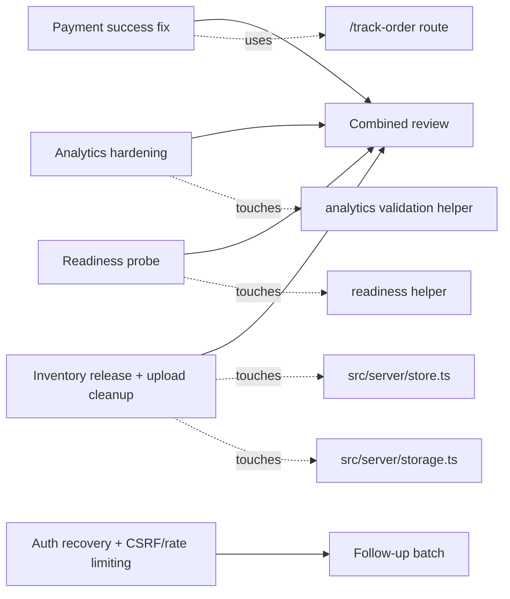

# PROJECT Audit Execution Plan

Reviewed against: `PROJECT_CURRENT_STATE_AUDIT.md`
Repository branch: `codex/audit-health-readiness`
Base commit: `290c004c0c9b2dcf15ba3d4a738ead47e7a768ab`
Date: 2026-07-26

This plan covers the currently verified, in-scope audit findings. The repo already has a few audit items fixed or partially fixed, and those are marked accordingly below. Out-of-scope systems from the audit remain excluded from execution: messenger/chatbot, courier integration, and subscription billing.

## 1. Verified findings

| ID | Finding | Audit Status | Verified Status | Evidence | Severity | Action |
| -- | ------- | ------------ | --------------- | -------- | -------- | ------ |
| F-01 | Payment success page links to `/track` instead of the real order tracking route | Confirmed | Confirmed | `src/app/payments/[provider]/success/page.tsx:19`; `src/app/track-order/page.tsx:66-71`; `src/app/actions.ts:202` already uses `/track-order?code=` | P0 | Fix the success CTA to point at `/track-order` with the order code and add a regression test |
| F-02 | Delivery cancellation does not release reserved inventory | Confirmed | Confirmed | `src/server/store.ts:1191-1218` has the release helper; `src/server/store.ts:1595-1600` only updates delivery status | P0 | Release inventory on cancelled delivery transitions and cover the path with a stock-restoration test |
| F-03 | Analytics IDs are injected into inline scripts without strict validation | Confirmed | Confirmed | `src/components/site-analytics.tsx:5-73`; `src/server/store.ts:650-750` does not validate `metaPixelId` or `gtmContainerId` | P1 | Add strict GTM/Meta validation, normalize IDs, and test that invalid values fail safe |
| F-04 | Product image replacement leaves old files on disk | Confirmed | Confirmed | `src/server/store.ts:463-465`; `src/server/storage.ts:39-40` delete is a no-op | P1 | Delete removed uploads when image sets are replaced and verify local cleanup behavior |
| F-05 | Health endpoint is not dependency-aware | Confirmed | Confirmed | `src/app/api/health/route.ts:7-9` returns only static `ok: true` data | P1 | Add a readiness probe/helper that checks critical runtime dependencies, at least PostgreSQL |
| F-06 | Customer address management is missing | Confirmed | Confirmed | `prisma/schema.prisma` has order `shippingAddress` only; no `Address` model or address routes were found | P1 | Defer to a schema-backed address batch after the core audit fixes land |
| F-07 | Password reset and email verification are missing | Confirmed | Confirmed | Repository search found no reset or verification routes, token models, or tests in `src`, `tests`, or `prisma/schema.prisma` | P1 | Defer to an auth-recovery batch because it needs product and email-provider decisions |
| F-08 | Rate limiting and CSRF hardening are missing on sensitive flows | Confirmed | Confirmed | No rate-limit middleware or CSRF guard was found in `src`; sensitive server actions and POST routes remain broad | P1 | Defer to a security-hardening batch after the current functional fixes |
| F-09 | Admin route protection exists | Already fixed | Verified fixed | `src/app/admin/layout.tsx:13-15` redirects unauthenticated users to login | P2 | No code change |
| F-10 | Payment callback signature verification exists | Already fixed | Verified fixed | `src/server/integrations.ts:44-52`; `tests/security.test.ts` covers exact HMAC matching | P0 | No code change |
| F-11 | Landing-page carousel integration exists | Already fixed | Verified fixed | `src/app/admin/landing-pages/page.tsx:71,113-114`; `src/lib/homepage-carousel.ts` is wired into the admin page and frontend rendering | P2 | No code change |
| F-12 | Safe upload path resolution exists, but file cleanup is incomplete | Partially valid | Partially valid | `src/server/storage.ts:18-40` saves safely; delete remains incomplete | P1 | Keep the path-safety logic and finish the delete/cleanup path in the current batch |

## 2. Dependency graph

The isolated route/helper fixes can run in parallel. `src/server/store.ts` and `src/server/storage.ts` are the only high-conflict shared files, so they should be merged after the smaller route/helper changes are reviewed.

## 3. Agent plan

| Agent | Git Branch | Task Scope | Owned Files | Dependencies | Required Tests | Acceptance Criteria |
| ----- | ---------- | ---------- | ----------- | ------------ | -------------- | ------------------- |
| Agent 1 | `codex/audit-payment-success` | Fix the payment success CTA and make the tracking target derived from the actual order | `src/app/payments/[provider]/success/page.tsx`, `src/lib/payment-routing.ts`, `tests/payment-routing.test.ts` | Depends on the existing `/track-order` route only | Targeted unit test for the tracking helper, `npm run lint` for touched files | Success pages always link to a live tracking route and still render when payment/order lookups are missing |
| Agent 2 | `codex/audit-analytics-hardening` | Harden analytics rendering and ID handling without breaking supported GTM/Meta behavior | `src/lib/analytics.ts`, `src/components/site-analytics.tsx`, `tests/security.test.ts` or a focused analytics test file | None | Unit tests for strict ID validation and safe fallback behavior, `npm run lint` for touched files | Invalid analytics IDs are rejected or stripped, and the rendered script content no longer accepts raw unvalidated input |
| Agent 3 | `codex/audit-health-readiness` | Add dependency-aware readiness checks for the app | `src/server/health.ts`, `src/app/api/health/route.ts`, `src/app/api/health/ready/route.ts`, `tests/health.test.ts` | Needs the current Prisma/DB setup pattern only | Unit test for the readiness helper, route test if practical, `npm run lint` | `/api/health/ready` fails when critical dependencies are missing and reports a safe, non-secret status payload |
| Agent 4 | `codex/audit-store-ops` | Fix delivery inventory release, product-image cleanup, and settings-side analytics validation | `src/server/store.ts`, `src/server/storage.ts`, `tests/persistence.test.ts` | Depends on Agent 2's analytics helper for validation reuse | Persistence regression tests for delivery cancellation and image replacement, plus lint | Cancelled delivery restores reserved stock exactly once, replaced images remove orphaned files, and settings validation rejects bad analytics IDs |

## 4. Integration order

1. Merge Agent 1.
2. Merge Agent 2.
3. Merge Agent 3.
4. Merge Agent 4.
5. Run the combined test and build suite on the orchestrator branch.
6. Create the PR only after the combined diff and tests are clean.

## 5. Risk controls

- Files most likely to conflict: `src/server/store.ts`, `src/server/storage.ts`, `tests/persistence.test.ts`, `tests/security.test.ts`.
- Database migration risk: low for this batch if the auth-recovery/address work is deferred; medium if later batches add schema-backed address or token tables.
- Checkout and payment risk: changing the success route must not break the existing `/track-order` flow or COD checkout redirect.
- Inventory consistency risk: delivery cancellation must be idempotent and must not double-restock orders that were already released.
- Authentication risk: recovery features are intentionally deferred until email delivery and token behavior are designed.
- Deployment risk: the cPanel deploy script and Passenger restart path must keep working with the same standalone artifact.
- Rollback approach: revert the integration commit, redeploy the last known-good standalone artifact, and restore the previous cPanel app root contents if needed.
- Production data safeguards: no destructive schema resets, no demo seed runs, no live payments, and no customer-message sends.

## 6. Verification gates

### Before a sub-agent is considered complete

- Scoped tests pass.
- `npm run lint` passes for touched files.
- The agent reports the exact files changed and the specific evidence it verified.

### Before orchestrator merge

- All approved agent diffs are reviewed directly.
- The combined diff has no unrelated churn.
- The batch-specific tests pass together.
- The payment, inventory, analytics, and readiness changes do not regress each other.

### Before PR creation

- `npm run lint`
- `npm test`
- `npm run build`
- Any route-level smoke checks that do not require live credentials

### Before PR merge

- Required CI checks are green.
- No unresolved review findings remain.
- The PR diff still matches the reviewed orchestrator commit.

### Before production deployment

- The merged commit SHA is recorded.
- The cPanel deployment token is available locally only.
- PostgreSQL access and the app root are confirmed.
- The deployment artifact builds successfully.

### After deployment completion

- `/`
- `/admin`
- `/track-order`
- `/api/health`
- `/api/health/ready`
- Product, cart, checkout, and upload smoke checks
- Admin authentication smoke check
