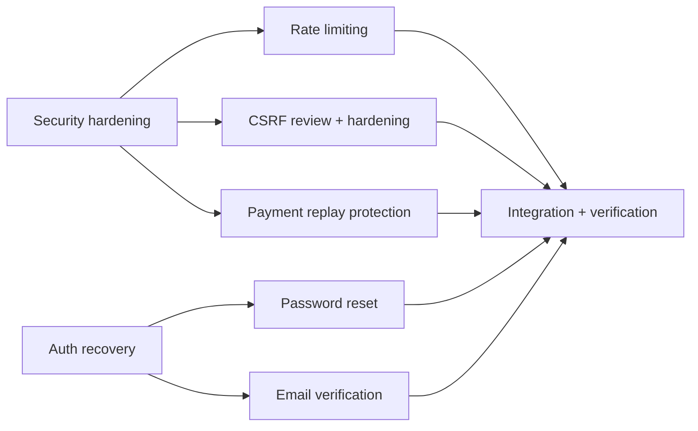

# Remaining Work Execution Plan

Reviewed against: `docs/REMAINING_WORK_VERIFICATION.md`
Base branch: `main`
Current orchestrator branch: `codex/bangladesh-ecommerce`

## Verified scope

Current batch: Security and authentication hardening.

| Task | Reason | Priority | Dependencies | Complexity | Included in Current Batch |
| ---- | ------ | -------- | ------------ | ---------- | ------------------------- |
| Rate limiting on auth, checkout, admin mutations, and payment callbacks | Reduce abuse and accidental load before expanding customer-account features | P1 | Session/auth plumbing and the existing route surface | M | Yes |
| CSRF review and hardening for server actions and POST routes | Reduce cross-site request risk on state-changing flows | P1 | Existing cookie/session behavior and the server-action surface | M | Yes |
| Payment callback replay protection | Prevent duplicate payment confirmation and inventory mutation | P0 | `src/app/api/payments/[provider]/callback/route.ts`, `src/server/integrations.ts`, payment logs | S/M | Yes |
| Password reset | Restore account recovery for customers | P1 | Email delivery or notification channel, token storage, auth flows | M | Yes |
| Email verification | Restore account trust and registration completeness | P1 | Email delivery or notification channel, token storage, auth flows | M | Yes |

Deferred to later batches:

- Customer profile editing
- Saved addresses and default address handling
- Static-page CMS management
- Persistent wishlist
- Production-carrying domain cleanup beyond the already live apex setup

## Dependency graph

## Agent assignment table

| Agent | Branch | Worktree | Scope | Owned Files | Dependencies | Required Tests | Acceptance Criteria |
| ----- | ------ | -------- | ----- | ----------- | ------------ | -------------- | ------------------- |
| Agent 1 | `codex/security-rate-limit-csrf` | `../worktrees/security-rate-limit-csrf` | Add rate limiting and CSRF hardening on sensitive routes and server actions | `src/server/auth.ts`, `src/app/actions.ts`, selected admin and checkout routes, shared test files | None | Targeted route and unit tests, `npm run lint`, `npm run build` | Sensitive flows reject abuse and cross-site submissions without breaking normal same-site behavior |
| Agent 2 | `codex/payment-replay-protection` | `../worktrees/payment-replay-protection` | Add replay protection to payment callbacks | `src/app/api/payments/[provider]/callback/route.ts`, `src/server/integrations.ts`, payment-related tests | Agent 1 only if shared middleware changes are introduced | Duplicate-callback and callback-signature tests, `npm run lint`, `npm run build` | Duplicate callback events are ignored safely and valid provider retries still work |
| Agent 3 | `codex/auth-recovery` | `../worktrees/auth-recovery` | Add password reset and email verification flows | `prisma/schema.prisma`, `src/app/*`, `src/server/auth.ts`, email-related helpers, auth tests | Token storage and email-provider decisions | Token lifecycle tests, auth integration tests, `npm run lint`, `npm run build` | Users can recover accounts and verify email without account enumeration or replay issues |

## Integration order

1. Merge Agent 1.
2. Merge Agent 2.
3. Merge Agent 3.
4. Run the combined test and build suite on the orchestrator branch.
5. Review the integrated diff before creating a PR.

## Conflict controls

Shared files with the highest conflict risk:

- `src/server/auth.ts`
- `src/server/integrations.ts`
- `src/app/actions.ts`
- `src/app/api/payments/[provider]/callback/route.ts`
- `prisma/schema.prisma`
- shared test files under `tests/`

Do not assign those files to concurrent agents unless the work is explicitly sequenced.

## Rollback plan

- Code rollback: revert the merged agent commits on the orchestrator branch.
- Migration rollback: only add reversible migrations; avoid destructive schema changes in this batch.
- Deployment rollback: redeploy the last known-good reviewed commit.
- Data safety: do not fabricate users, issue live payments, or delete existing production data.

